# PH-CU-S для ComfyUI

**Официальный сайт и плагин для Photoshop:** [ph-cu-s.com](https://www.ph-cu-s.com)

Набор нод для интеграции плагина Photoshop `PH-CU-S` с `ComfyUI`.
Поддержка с версии 2025 года.


## Описание нод

### 🎨 PH-CU-S Input

- Читает данные из папки `exchange`:
  - `canvas.png` — холст
  - `mask.png` — маска
  - `prompt.txt` — промпт
  - `negative.txt` — негативный промпт
  - `seed_fixed.txt` и `seed_in.txt` — seed
  - `step.txt` — шаг
  - `cfg.txt` — CFG
  - `extra_img_1.txt` — дополнительное изображение 1
  - `extra_img_2.txt` — дополнительное изображение 2
  - `extra_img_3.txt` — дополнительное изображение 3
- Возвращает:
  - `Canvas` (IMAGE)
  - `Mask` (MASK)
  - `Prompt` (STRING)
  - `Negative Prompt` (STRING)
  - `Width`, `Height`, `Seed`, `Custom Step`, `CFG`
- Использует проверку MD5, чтобы запускать повторное выполнение при изменении `canvas.png` или `mask.png`.
- Скриншот: `images/input.png`

### 🎨 PH-CU-S Save Seed

- Принимает `seed` и записывает его в `exchange/seed_result.txt`.
- Передаёт значение seed дальше по графу.
- Удобно, когда ComfyUI генерирует seed, а плагин Photoshop должен получить окончательное значение.
- Скриншот: `images/save_seed.png`

### 🎨 PH-CU-S Output

- Наследует функциональность `SaveImage`.
- Сохраняет итоговое изображение во временную папку.
- После сохранения отправляет HTTP-запрос локальному серверу `PromptServer`, чтобы уведомить плагин о завершении:
  - `http://127.0.0.1:{port}/phcus/renderdone?filename={filename}`
- Скриншот: `images/out.png`

## Как работает интеграция

- `PH-CU-S Input` загружает входные данные, подготовленные Photoshop-плагином.
- ComfyUI обрабатывает изображение и передает результат в `PH-CU-S Output`.
- `PH-CU-S Save Seed` сохраняет итоговый seed обратно для плагина.
- Вся связка использует директорию `exchange` для файлового обмена и HTTP-сигнал для уведомления о завершении.

## Установка

1. Скопируйте папку `ComfyUI_PH-CU-S` в каталог `ComfyUI/custom_nodes`.
2. Убедитесь, что внутри находятся:
   - `nodes.py`
   - `server.py`
   - `exchange/`
   - `images/`
3. Запустите ComfyUI.
4. В интерфейсе ComfyUI найдите категорию `PH-CU-S` и добавьте нужные ноды.
5. Убедитесь, что Photoshop-плагин `PH-CU-S` запущен и настроен на работу с папкой `exchange`.

## Установка через GitHub

1. Склонируйте репозиторий на локальный компьютер:
   ```bash
   git clone https://github.com/SaidAuita/ComfyUI_PH-CU-S.git
   cd ComfyUI_PH-CU-S
   ```
2. Скопируйте папку `ComfyUI_PH-CU-S` в каталог `custom_nodes` ComfyUI:
   ```powershell
   Copy-Item -Path .\ComfyUI_PH-CU-S -Destination C:\path\to\ComfyUI\custom_nodes -Recurse
   ```
   Если хотите скопировать только содержимое папки, используйте:
   ```powershell
   Copy-Item -Path .\ComfyUI_PH-CU-S\* -Destination C:\path\to\ComfyUI\custom_nodes -Recurse
   ```
3. Запустите ComfyUI.
4. В интерфейсе ComfyUI найдите категорию `PH-CU-S` и добавьте нужные ноды.

## Результаты работы

Примеры итоговых изображений:

- `images/ph_00.jpg`
- `images/ph_01.jpg`
- `images/ph_02.jpg`

## Краткое описание плагина PH-CU-S

PH-CU-S — это продвинутый UXP-плагин для Adobe Photoshop, который бесшовно интегрирует ComfyUI в рабочий процесс Photoshop. Он позволяет выполнять сложное ИИ-генерирование, инпейнтинг (inpainting) и аутпейнтинг (outpainting), не покидая рабочий холст.

### Основные возможности и функции:
- **Прямая интеграция с Photoshop:** Работайте с привычными инструментами — слоями, выделениями и масками. Плагин автоматически синхронизирует холст, активную область выделения, параметры генерации и готовые изображения.
- **30 слотов для промптов (5 вкладок x 6 слотов):** Сохраняйте и организуйте до 30 пресетов настроек на 5 цветных вкладках.
  - На вкладках могут отображаться компактные текстовые названия слотов при включении параметра `SHOW_PROMPT_SET_NAMES` в `config.txt`.
  - Цвета вкладок можно настраивать и связывать с именами (например, `#ffb0b0 - Pink` в файле конфигурации `config.txt`).
- **Улучшенный импорт и экспорт:**
  - **Кнопки `6▼` и `30▼`:** Быстрая загрузка промптов из `.txt` файла в активную группу или последовательно во все 30 слотов. Поддерживается чтение негативных промптов (строки, начинающиеся с `N:`) и описаний слотов (строки с `D:`). Строки, начинающиеся с `#`, считаются комментариями и пропускаются.
  - **Кнопка `30▲`:** Экспорт всех 30 слотов в текстовый файл с понятным форматированием.
- **Режимы AUTO и Loop (`∞`):**
  - **Режим AUTO:** Последовательная генерация пакета по слотам 1–6 (или меньшего числа слотов, начиная с текущего выбранного).
  - **Режим Loop (`∞`):** Позволяет бесшовно переходить к следующему набору промптов (цветной вкладке) при достижении конца текущей группы в режиме AUTO.
- **Умное приведение к сетке (Snap to Grid):** Автоматическое округление размеров выделения под требования моделей (Flux — кратно 64px, Qwen — кратно 112px, Personal grid — кратно 8px или произвольно) для достижения максимального качества. Автоматически добавляет контекстный отступ (padding) при экспорте выделений, сделанных кистью.
- **Защита от субпиксельного сдвига:** Плагин временно снимает активное выделение в Photoshop перед вставкой сгенерированного слоя, предотвращая некорректное авто-масштабирование (событие `placeEvent`), после чего точно позиционирует и трансформирует слой программно.
- **Единый блок «Crop & Uncrop»:** Удобный объединенный блок для точного кадрирования (crop) или расширения холста (uncrop) в выбранных направлениях с интерактивным выбором единиц (миллиметры, дюймы, пиксели) и автосохранением выбора в локальное хранилище.
- **Работа по локальной сети (PC / MAC):** Возможность запустить ComfyUI-сервер на одном мощном компьютере и подключать к нему несколько рабочих мест Photoshop (Windows и macOS) по сети.
  - Включает готовые сетевые скрипты запуска (`start_25H2_v2.bat` / `stop_25H2_v2.bat`) и автоматическое монтирование сетевого диска.
  - Прямое локальное чтение файлов через протокол `file://` исключает задержки и кэширование на удаленных клиентах.
- **Работа с высоким разрешением:** Редактирование полноразмерных файлов за счет генерации только выделенной области. Включает предупреждение о превышении размера (параметр `MAX_IMAGE_MP`, по умолчанию 4 Мп) с возможностью быстро уменьшить отправляемый фрагмент до 2/3/4 Мп.
- **Локализация на 8 языках:** Интерфейс плагина полностью переведен на английский, русский, испанский, японский, немецкий, китайский, португальский и французский языки.
- **Надежное резервное копирование лицензии:** Механизм сохранения состояния лицензии в домашний профиль (`~/.ph-cu-s/.license_state`) в обход ограничений песочницы UXP на Windows и macOS с автовосстановлением при установке.
- **Оптимизация производительности:** Протестирована стабильная работа на доступном оборудовании (например, RTX 3060 с 6 ГБ VRAM для Flux 2 Klein). На мощных системах полностью поддерживаются тяжелые рабочие процессы, такие как Qwen Image Edit 2511 и Flux 2 Dev.


## Скриншоты

- 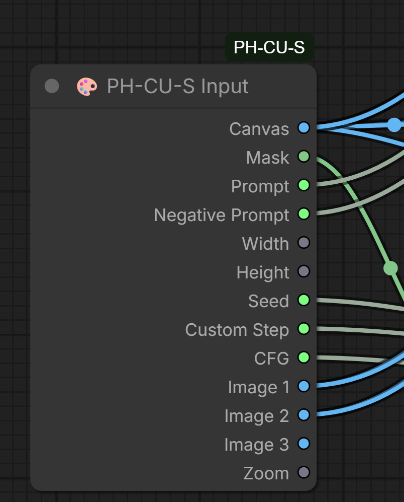
- 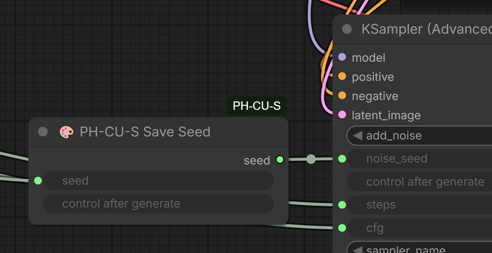
- 

## Примеры работы в Photoshop c плагином PH-CU-S
- 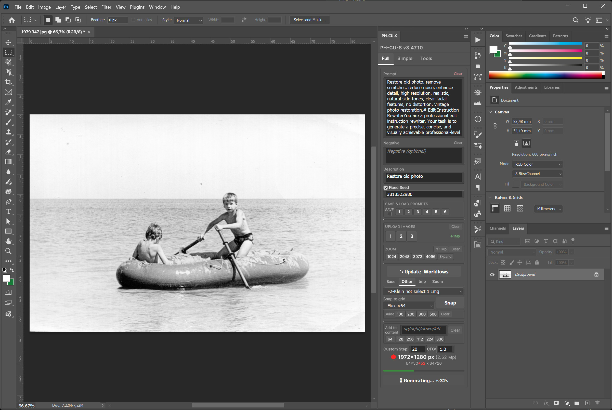
- 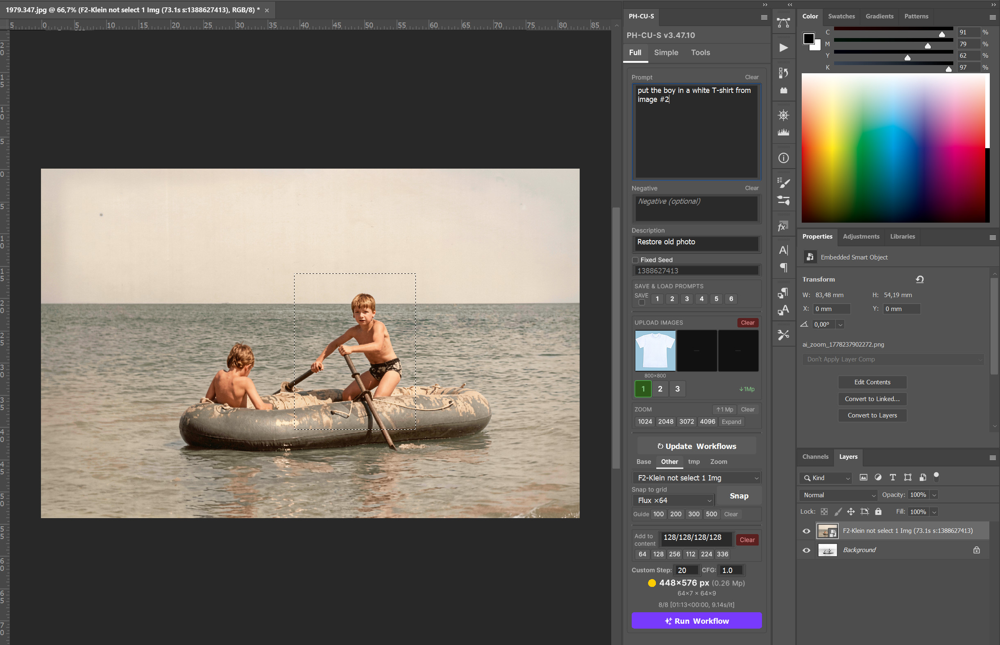
- 
- 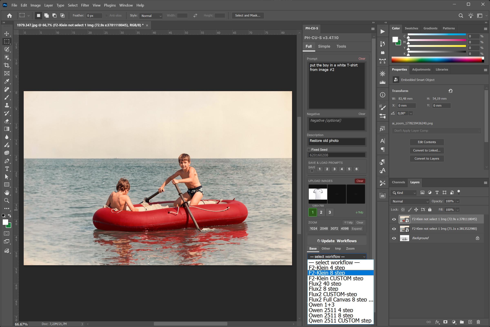
- 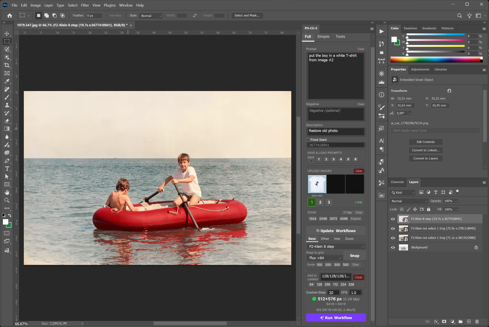
- 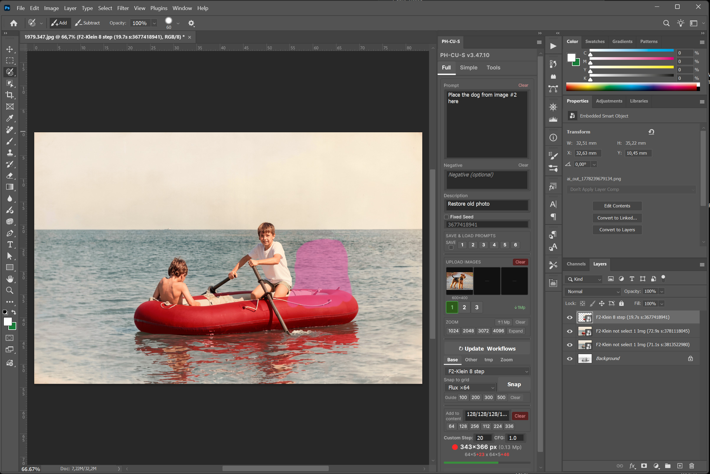
- 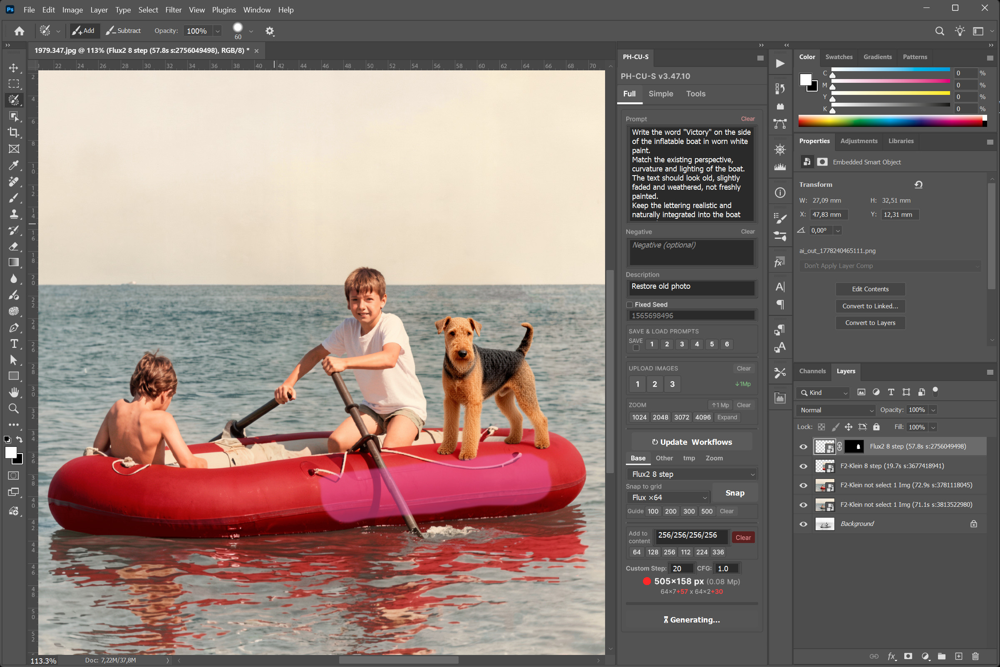
- 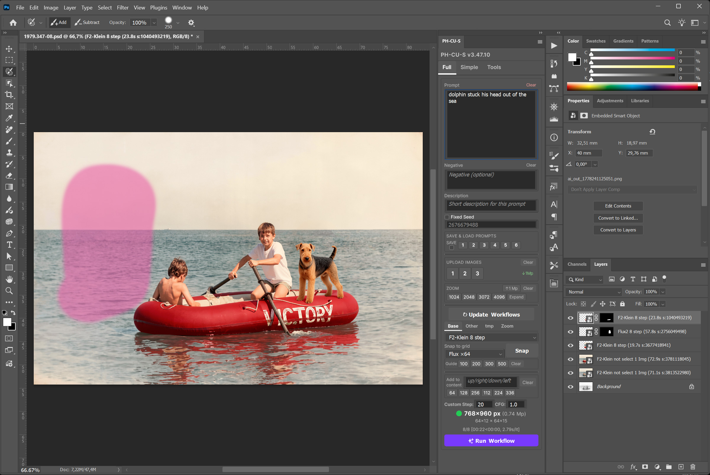
- 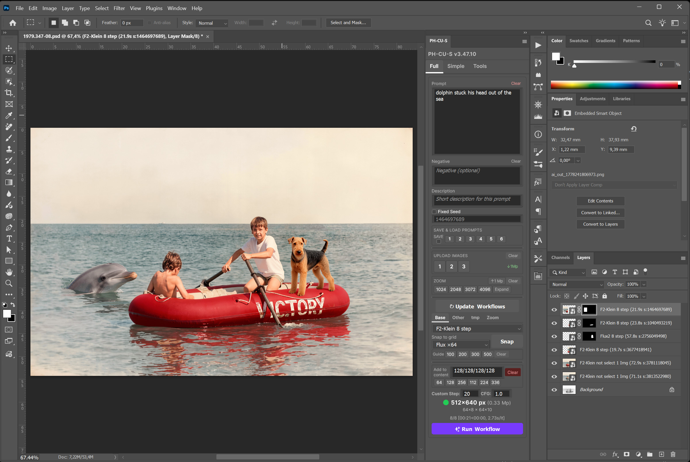
- 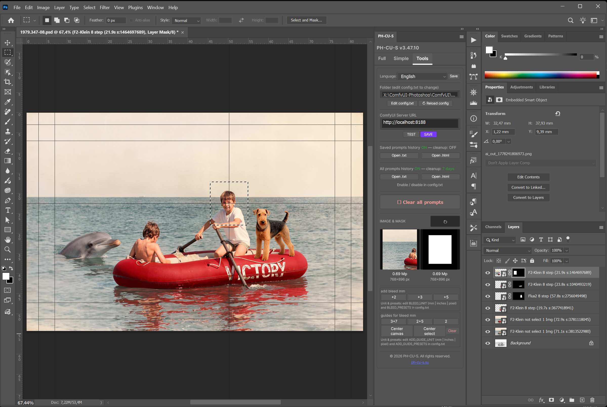
- 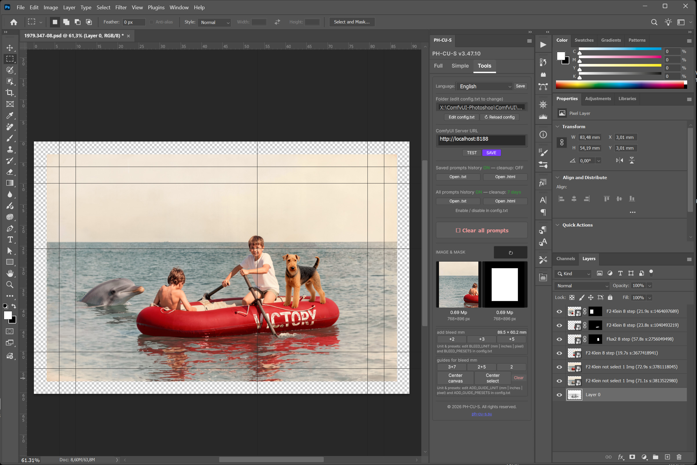 
